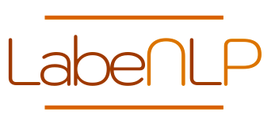
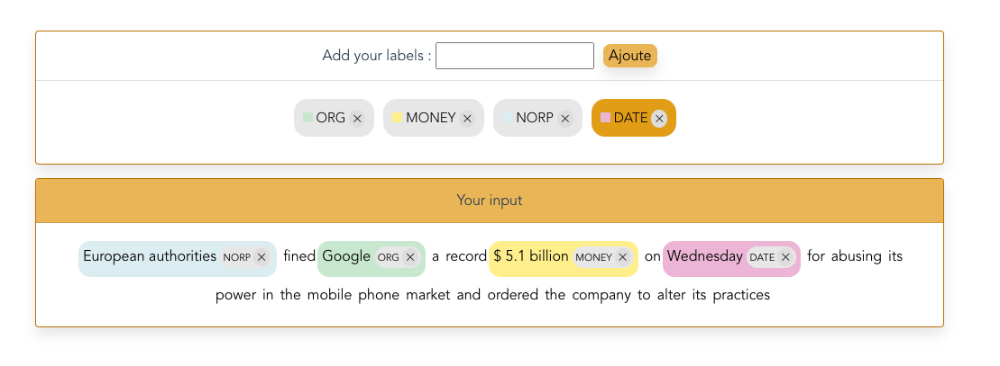

**NLP Annotator:**

- NER Annotation --> 65%
- Q&A Annotation --> 0%

**to be completed !**

## Screenshot from the first version beta

## TODO:

- why not, add a database, so we could save the annotations and come back to it later to finish it.
- some improvement for token management